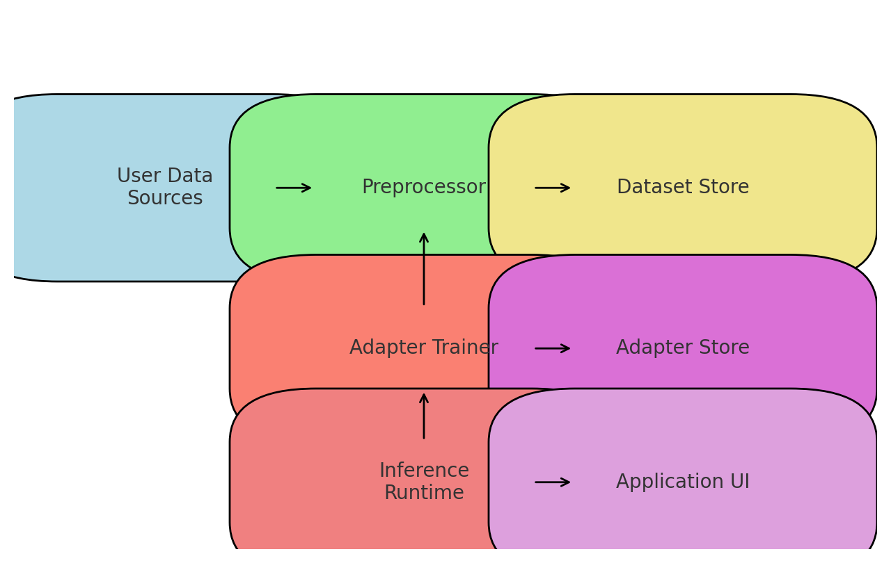
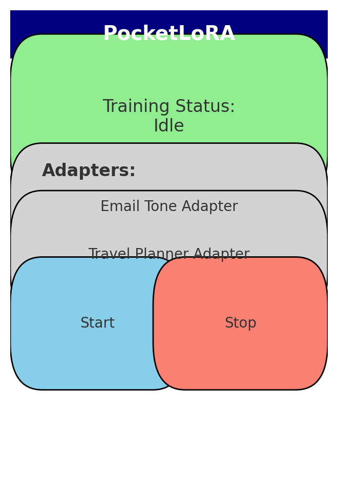

# Samsung EnnovateX 2025 AI Challenge Submission

- **Problem Statement:** On-Device Fine-Tuning Framework for Billion+-Parameter LLMs
- **Team Name:** PocketLoRA Innovators
- **Team Members:** Karthick Kumarasamy
- **Demo Video Link:** TBD

## Project Artefacts

- **Technical Documentation:** `/docs/technical_design.md`, `/docs/evaluation_plan.md`
- **Source Code:** `/src/AndroidApp`, `/src/AdapterTrainer`
- **Models Used:** Llama 3.2 3B (Hugging Face link), Gemma-2 2B
- **Models Published:** [Link to HuggingFace if you publish adapters]
- **Datasets Used:** Private user message dataset (locally generated)
- **Datasets Published:** None (privacy-preserving)
- **Attribution:** ExecuTorch, ONNX Runtime Training, QLoRA/LoRA techniques

# PocketLoRA: On-Device Fine-Tuning for Billion-Scale LLMs

📱 **PocketLoRA** is an efficient framework for **on-device fine-tuning** of Billion+ parameter scale LLMs on **Galaxy S23–S25 class smartphones** (or equivalent edge devices).  
It enables adapting pre-trained LLMs to a user’s **personal data** while preserving **privacy, efficiency, and usability**.

---

## 📌 Problem Statement
Large Language Models (LLMs) are powerful, but:
- They are trained on **general-purpose data**, not personal context.
- Fine-tuning typically requires **cloud GPUs**, raising cost and privacy issues.
- Smartphones have **tight memory, compute, and thermal constraints**.

**Goal:** Enable practical **adapter-based fine-tuning** of LLMs fully **on-device**, respecting the constraints of mobile hardware.

---

## 🚀 Our Approach
- Use **quantized base models (NF4)** with memory mapping to reduce RAM usage.
- Train **LoRA / QLoRA adapters** (20–150 MB) instead of full models.
- Implement **thermal-aware scheduling**: train only when charging, Wi-Fi, and screen-off.
- Maintain **privacy guarantees**: no raw text leaves device, only adapters exported.
- Provide a **user-friendly app UI** to manage adapters.

👉 Details: [docs/approach.md](docs/approach.md)

---

## 🛠️ Technical Stack
- **Frameworks**: PyTorch Mobile, ExecuTorch, ONNX Runtime Mobile  
- **Quantization**: bitsandbytes (NF4), GPTQ  
- **Fine-Tuning**: LoRA / QLoRA  
- **Optimizers**: Adafactor, Lion  
- **UI**: Android (Kotlin + Jetpack Compose)  

👉 Full list: [docs/technical_stack.md](docs/technical_stack.md)

---

## 📐 Architecture
The architecture consists of:
1. **Data Ingestion** → 2. **Local Dataset Store** →  
3. **Adapter Trainer** → 4. **Adapter Store** →  
5. **Inference Runtime** → 6. **Scheduler & Privacy Controls**

👉 More details: [docs/architecture.md](docs/architecture.md)

---

## ⚙️ Implementation
- Pseudocode for loading, training, saving, and inference.
- Optimizations: quantization, micro-batching, checkpointing.
- Thermal/power-aware scheduler.  

👉 Full pseudocode: [docs/implementation.md](docs/implementation.md)

---

## 📲 Installation
Step-by-step setup:
1. Clone repo.  
2. Quantize base model to NF4.  
3. Build and install Android app.  

👉 Setup guide: [docs/installation.md](docs/installation.md)

---

## 🧑‍💻 User Guide
- **Start training** with personal text.  
- **Monitor progress** via training state (Idle, Training, Cooldown).  
- **Hot-swap adapters** during inference.  
- **Manage adapters**: enable, export, delete.  

👉 Walkthrough: [docs/user_guide.md](docs/user_guide.md)

---

## ✨ Key Features
- 🔒 Fully **on-device** (privacy-preserving).  
- ⚡ **Resource-efficient** (≤ 6 GB RAM peak).  
- 🛡️ **Thermal & power-aware** scheduling.  
- 🎛️ Multiple adapter management.  
- 📱 Clean **mobile UI** with monitoring.  

👉 See: [docs/features.md](docs/features.md)

---

## 📂 Repository Structure

## 📂 Repository Structure

.
├── docs/
│ ├── approach.md
│ ├── technical_stack.md
│ ├── architecture.md
│ ├── implementation.md
│ ├── installation.md
│ ├── user_guide.md
│ ├── features.md
│ └── screenshots/
│ ├── system_flow.png
│ ├── memory_budget.png
│ ├── app_ui.png
│ ├── training_loop.png
│ └── adapter_lifecycle.png
├── app/ # Android app source
├── tools/ # Model quantization & preprocessing scripts
├── models/ # Base model (NF4 quantized, not checked in)
└── adapters/ # Trained LoRA adapters

---

## 📜 License
Released under the [MIT License](LICENSE).

---

## 🏆 Submission Notes
This repository is part of the **Samsung EnnovateX 2025 AI Challenge** under Problem Statement #5:  
_On-Device Fine-Tuning Framework for Billion+ Parameter LLMs._
