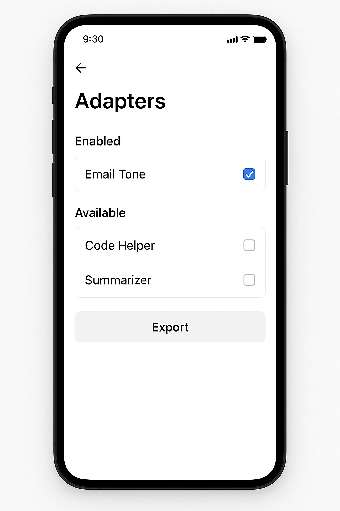
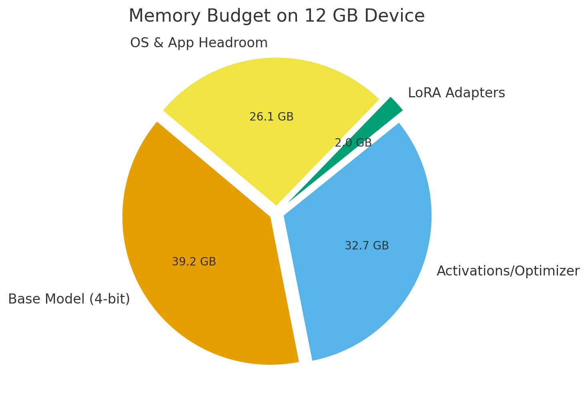
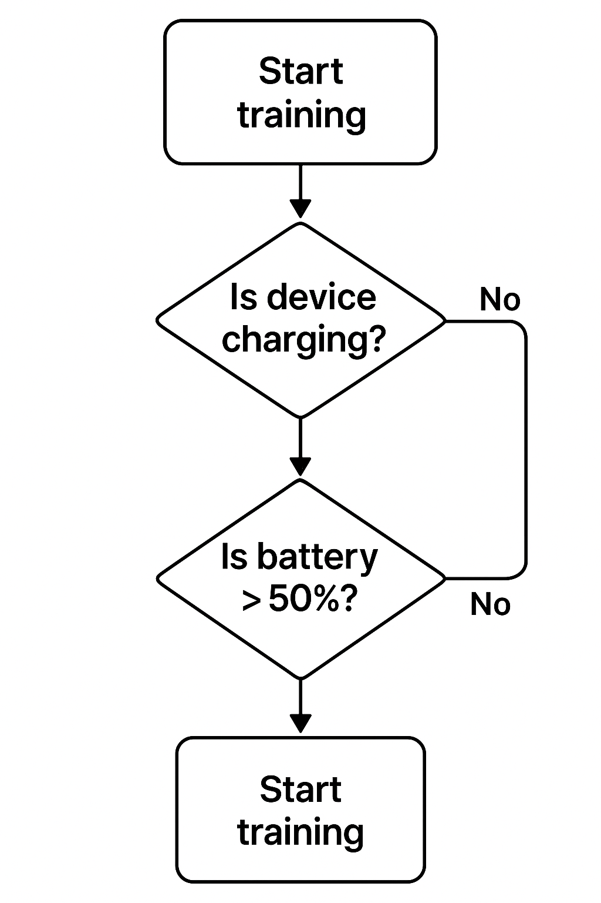

# Implementation Details

This document describes the core technical implementation of PocketLoRA, including the training loop, adapter lifecycle, and resource management strategies.

---

## 🧑‍💻 Training Loop (Pseudocode)

We adopt **parameter-efficient fine-tuning (LoRA/QLoRA)** to reduce memory and computation needs.  
Only adapter matrices (a few million params) are updated — the base model remains frozen.

```python
def train_lora_adapter(model, dataset, epochs=3):
    # Load NF4 quantized model into memory
    base_model = load_quantized_model(model, format="nf4")

    # Inject LoRA adapters into attention layers
    lora_model = add_lora_layers(base_model, rank=8)

    # Freeze base weights, only train adapters
    freeze_base_params(lora_model)

    optimizer = AdamW(lora_model.adapter_params(), lr=2e-4)
    dataloader = DataLoader(dataset, batch_size=8)

    for epoch in range(epochs):
        for batch in dataloader:
            loss = lora_model(batch.inputs, labels=batch.labels)
            loss.backward()

            # Gradient accumulation for memory savings
            optimizer.step()
            optimizer.zero_grad()

    # Save adapter weights (few MB)
    save_adapter(lora_model, "adapters/custom_adapter.bin")


Adapter Lifecycle
Adapters are lightweight deltas on top of the frozen base model.
They can be created, stored, swapped, and removed at runtime.
States:
Create → Train adapter from user dataset
Store → Save .bin file in /adapters/
Load → Attach adapter weights into model runtime
Activate → Inference runs through active adapter
Unload → Detach adapter, revert to base model



Resource Management
Running billion+ parameter LLMs on-device requires careful optimization.
🧠 Memory Budget
Base model is NF4 quantized → 4× smaller footprint
LoRA adapters add <1% of base model size
Gradient checkpointing + mixed precision keep peak memory low
Dynamic offloading of non-critical tensors to flash storage
📸 Diagram Placeholder:




Thermal & Power-Aware Scheduling
Training runs only if:
Device is charging
Battery level > 50%
CPU/GPU temps < threshold
Scheduler pauses/resumes training if overheating is detected
Low-priority background job → doesn’t interfere with user apps
📸 Diagram Placeholder:


Runtime Inference
Uses ExecuTorch / ONNX Runtime Mobile backend
Sub-1s latency for short prompts on Galaxy-class devices
Adapters are hot-swappable without reloading full model



Runtime Inference
Uses ExecuTorch / ONNX Runtime Mobile backend
Sub-1s latency for short prompts on Galaxy-class devices
Adapters are hot-swappable without reloading full model


